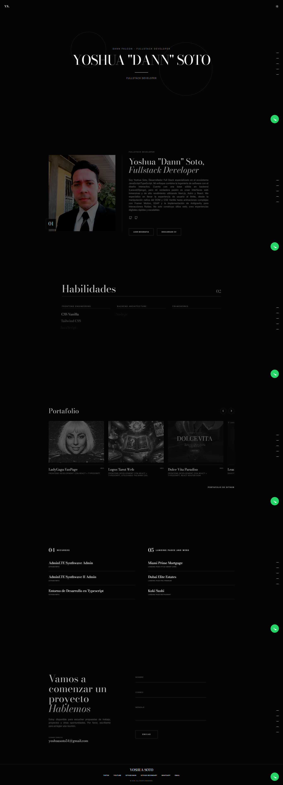

# Portfolio - Yoshua Soto | Fullstack Developer

<div align="center">
  
</div>

## 🚀 Descripción

Portafolio profesional moderno y minimalista, diseñado para mostrar proyectos, habilidades y experiencia como desarrollador Fullstack. El proyecto se centra en una experiencia de usuario fluida con animaciones sofisticadas y un diseño de alto impacto visual.

## 🛠️ Tecnologías

Este proyecto está construido con un stack tecnológico moderno:

- **React 19** - Biblioteca para interfaces de usuario.
- **TypeScript** - Tipado estático para código robusto.
- **Vite** - Build tool ultrarrápido.
- **Tailwind CSS** - Framework de estilos "utility-first".
- **Framer Motion** - Animaciones complejas y transiciones suaves.
- **Lucide React** - Iconografía moderna.
- **EmailJS** - Servicio de envío de correos electrónicos directamente desde el frontend.

## ✨ Funcionalidades Principales

- **Diseño Responsivo**: Adaptado perfectamente para móviles, tablets y escritorio.
- **Tema Claro/Oscuro**: Toggle para cambio de tema visual.
- **Animaciones Suaves**: Transiciones de página y elementos interactivos con Framer Motion.
- **Galería de Proyectos**: Visualización de trabajos con modales detallados.
- **Formulario de Contacto Funcional**: Integrado con EmailJS para envío real de correos.
  - Validación de estados (enviando, éxito, error).
  - Modal de confirmación de envío.
- **Botón de WhatsApp**: Acceso directo flotante para contacto rápido.

## ⚙️ Configuración e Instalación

1.  **Clonar el repositorio**

2.  **Instalar dependencias**

    ```bash
    npm install
    ```

3.  **Configurar Variables de Entorno**
    Crea un archivo `.env` o `.env.local` en la raíz del proyecto y agrega tus credenciales de EmailJS:

    ```env
    VITE_EMAILJS_SERVICE_ID=tu_service_id
    VITE_EMAILJS_TEMPLATE_ID=tu_template_id
    VITE_EMAILJS_PUBLIC_KEY=tu_public_key
    ```

4.  **Correr en Desarrollo**

    ```bash
    npm run dev
    ```

5.  **Construir para Producción**
    ```bash
    npm run build
    ```

## Sobre el Desarrollador 👨‍💻

**Yoshua Soto** (Dann Falcon Dev)  
_Fullstack Developer | Especialista en TypeScript_

Creador apasionado por construir aplicaciones que no solo funcionan, sino que asombran. Utilizando la potencia de la IA (Gemini) y tecnologías web modernas, me enfoco en entregar experiencias de usuario (UX) memorables e inmersivas.

📫 **Contacto**

- **Email**: yoshuasoto54@gmail.com
- **WhatsApp**: +58 0422 033 1995

##


© 2026 Dann Falcon Media. Todos los derechos reservados.
